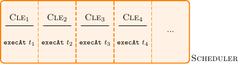
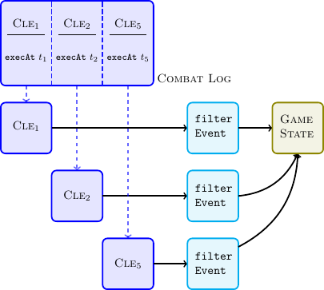

# Events

An event is a function name and arguments, which shall be called on a target
object at a certain point in the future. The event also includes information
about the origin and source objects. These are the objects which caused the
event to be generated.

You never directly create these events, but rather uses one of the many
wrappers that are available in a script context. This is to ensure that the
fields such as `source` and `origin` are properly set. It also makes it easier
because you don't have to worry about those.

## Event Handling

All game state changes always start with a packet (e.g., `GAMETICK`,
`TELEPORT` or `CAST`).

All events scheduled with `scheduleEvent` are queued in a scheduler,
respecting the `executeAt` field of a `CombatLogEvent` as shown in the next
Figure.

If an event has `executeAt == tnow` a `GAMETICK` packet is emitted. For
illustrative purposes lets assume that `t1 = t2 = tnow` and we receive
a new packet (`CLE5`) with the same `executeAt` time. Note that a packet can
introduce now events as well. This results in the following situation

All events that have to be processed in the current `GAMETICK` are inserted in
the Combat Log (oldest event will be processed first). Each entry is processed
independently and will affect the game state only after all events have been
processed:

The event filter was introduced to provide a way for auras to react on events
in certain cases (e.g. a damage shield). More specifically an aura can

* modify the event arguments
* post reaction events (directly inserted in Combat Log)

When a Combat Log Event is processed the following stages are executed:

* Event source and target unit can react.
* Apply the event (and all reactions) to the game state.
* Check if any units are dead.

In the case multiple auras are present, the following evaluation ordering is
used to resolve conflicts:

* Auras on the source unit, sorted by priority
* Auras on the target unit, sorted by priority

