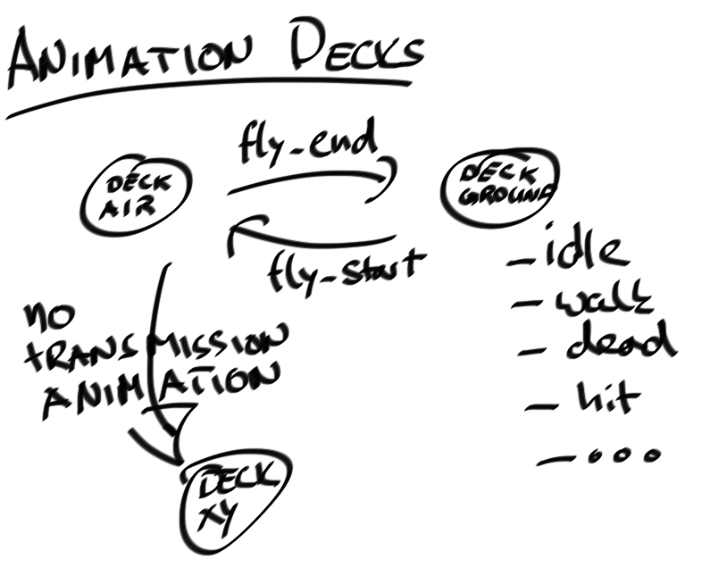

# Animations

Animations breathe life into models used by world objects. Here we focus on the
mechanics of the internal animation system. Additionally we will discuss two
important API methods that allow designers to steer the animation of
characters.

## Definitions

* *Animation label*: Label describing a single animation, e.g. "walk", or
  "death".

* *Animation deck*: A bundle of animations of the same position type, e.g.
  the "air" animation deck contains all animations a model can perform while
  flying.
  A set of standardized animations is defined for every deck (see below).

* *Deck transition*: Transmissions between animation decks can be animated
  (optional). This is can for example be used to let a unit land or takeoff,
  when switching between the "air" and "ground" animation decks.

## The Animation State Machine

The animation decks are organized in a FSM (see Figure above). A transition
from one to another deck triggers the animation of labeled transition arrows.

**Currently, the transition states are hardcoded** (but will be exposed to the
new editor, once it is available):

* ground (Default),
* air (Airborne units).

The initial animation deck state can be set in the `worldObjectTemplate`:

    aUnit = (worldObjectTemplate "Unit") {
        name: "UnitA", behavior: "A", scale: 0.3,
        movementSpeed: 1, positionType: "air"
   }

### unitSetAnimationDeck(unit, newDeckName) :: undefined

Sets the new animation deck for unit. Currently, we support the `ground` and
`air` animation decks. On transition from `ground` to `air` the animation with
the label `fly_start` (if defined) is played with a 2 seconds duration. In the
opposite direction we play the animation with the label `fly_end`.

## Naming Conventions

Animation labels can be defined in the editor for each model. To be able to
use the animation machinery the labels have to conform to the following
guidlines.
The animation label is composed of the animation deck name its action
description (`animationDeckName_actionName`):

* idle (standing/Floating)
* walk (slowly moving)
* run  (fast moving)
* hit  (unit is hit by damage)
* death
* attack (default fallback melee attack)
    * slash (single slash, sword)
    * stab  (quick stab, dagger)
    * slam  (big overhead swing, two-handed hammer)
* cast (default fallback magical spell cast)
    * directed (caster facing the target, fireball)
    * remote   (caster not facing the target, rain of fire)
    * centered (aoe spell centered around caster, group heal)
    * summon   (summoning/reviving a creature/minion)
* block (hiding behind a shield/weapon)

To define the idle flying animation the label `air_idle` has to be used in the
editor.

TODO: How do we differentiate instant cast animations from normal cast
animations?

## Playing custom animations

Some models may offer additional animations, e.g. the dragon model has an
animation for sleeping. Designers might want to use these animations to script
"mini-cutscenes". Using the following API method, the animation state of a
unit can be changed:

### unitSetAnimation(unit, name, duration) :: undefined

The custom animation is played for the specified duration, or looped until
overridden if the duration is zero.

Note that the labels of custom animations do not follow any naming convention
and do not belong to a specific animation deck.

