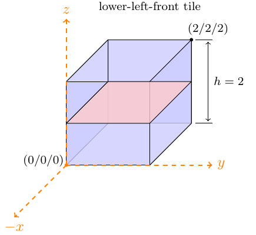

# Terrain

The terrain class defines geometries of the worlds the players moves on. We
have the following conventions for tiles and models:

* `+z` is up
* `-x` is forward

A terrain is specified with two components. First we require one definition of a
"tile" for every tile present in the terrain. Subsequently these tiles can be
instantiated and positioned to represent worlds (best to use the in-browser
editor). Both components are specified in JSON as shown in the corresponding
sections.

## Tiles

Tiles are squares defining the origin of the local coordinate system in the
center of the tile. The tile has a `z` extension from `[-1, 1]` and the `z=0`
layer is in the upper-left tile.

Tile IDs are unique names used for referencing by tile instances. The model name
corresponds to a OBJ model to be found in the `world` directory of the
encounter.

    tiles:
        tile_name:
            model          : "model_name"
            vertices       : [-1,-1,0, -1,1,0, 1,-1,0, 1,1,0]
            facesProject   : [0,1,2, 1,3,2]
            facesIntersect : []
            bbox           : {pmin:[-1,-1,-1], pmax:[1,1,1]}

### Creating Tiles with Blender

TODO.

## Tile Instances

Terrains are defined using the previously introduced tiles. Each tile instance
has a unique identifier and references the tile name it represents. Position and
rotation concertize the instance.

    data:
        0:
            tile: "tile_name",
            pos : [0,0,9],
            rot : 0

        1:
            tile: "tile_name",
            pos : [0,0,6],
            rot : 0

        2:
            tile: "another_tile",
            pos : [4,4,6],
            rot : 0

All rotations are anticlock-wise and the rotation axis is the origin of the
tile:

* 0: no rotation
* 1: rotated by 90 degrees
* 2: rotated by 180 degrees
* 3: rotated by 270 degrees

## Movement and Terrain Positions

All `WorldObjects` are located at a `TerrainPosition`. Computing

### getTerrainPosition(tile, local_x, local_y) :: TerrainPosition

Return the "global" terrain position corresponding to `(local_x, local_y)` in
the specified tile.

### moveTowards(guid, velocity = 1.0, min_distance = 0.0) :: undefined

Convenient method for creatures to walk towards a player or position. TODO.

## Loading a Terrain and Spawn Locations

In order to load terrain and define spawn location the encounter glue file has
to implement the following two methods.

### loadTerrain(instance) :: undefined

E.g., after

    loadTerrain: (instance) ->
        instance.createTerrain "DrEvilsLair"

the terrain specified in 'DrEvilsLair.coffee' is loaded and upon bootstrapping
sent to all players.

### getSpawnLoaction(instance, player, role) :: undefined

Method sets spawn location of player or role, e.g.,

    getSpawnLocation: (instance, player, role) ->
        return instance.terrain.getTerrainPosition 0, 0.5, 0.5

meaning all players (regardless of role and player) will spawn in tile `0` at
local coordinates `(0.5, 0.5)`.
